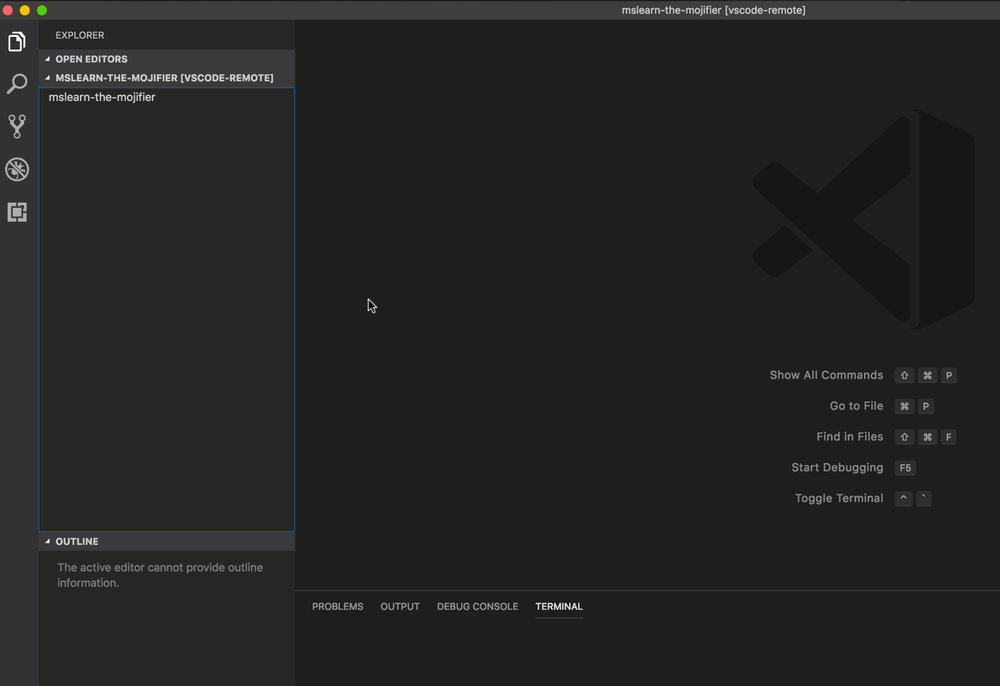
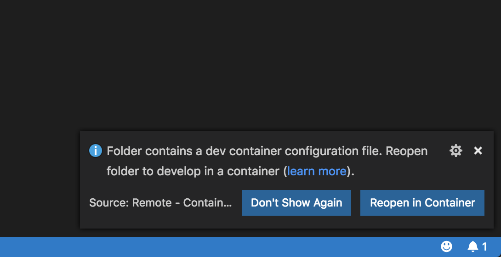
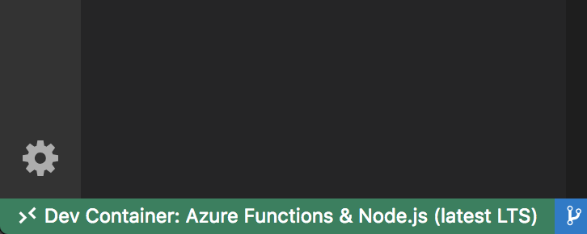

# Environment setup for the mojifier workshop
This repository is purely for the setup instructions for the workshop, it isn't the workshop code itself. 

> The actual workshop code can be found here: [Mojifier on Github](https://github.com/deanobalino/mslearn-the-mojifier)

# Getting Started

## Install Docker

You will **need** to have Docker installed on your local machine. You can follow instructions to install [here](https://docs.docker.com/install/). 

## Install Visual Studio Code (Insiders Edition)

To support the remote development environments we will be using in this workshop you will need to use the Insiders edition of VS Code. You can download and install it from [here](https://code.visualstudio.com/insiders/)

## Install the Remote Development Extension



1. Navigate to the Extension pane within VS Code (Insiders)
2. Search for 'Remote Development'
3. Install the extension
4. Reload VS Code (Insiders)

## Clone the workshop repository

Perform the following commnand in a terminal window.

```
git clone https://github.com/deanobalino/mslearn-the-mojifier.git
```


## Activate Remote Development

1. Open the `mslearn-the-mojifier` directory within VSCode Insiders
2. When you open the project you should be prompted to 'Reopen in Container' 



3. Click 'Reopen in Container'
   
   >This will launch a docker container locally, and bind your local file system to the container. This container has all of the pre-requisites that you need to comple the workshop. think node, npm etc, so everything should work smoothly from now on :-)

4. Once this is all working, in the bottom left of the window, you should see the green bar indicating the following:



## All Done

And that's it, you're now all set up and ready to enjoy the workshop! 

